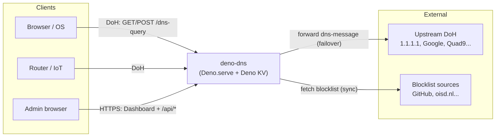
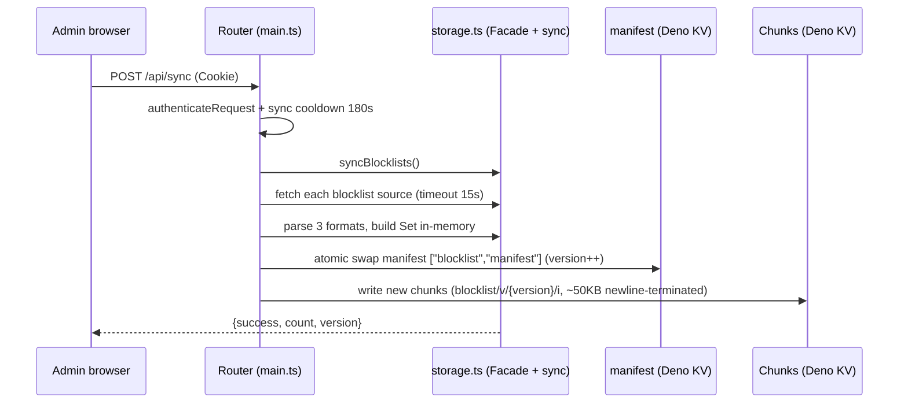

# 🏗️ Architecture — deno-dns

> Architecture documentation for the DNS-over-HTTPS serverless with content filtering and administration dashboard. Target: architecture reviewers, operators, new contributors. Related: [README](../README.md) · [Software Design](SOFTWARE_DESIGN.md)

---

## 1. Overview

**deno-dns** is a DoH server (RFC 8484) single-process running on Deno, serving as a filtered DNS forwarder: receives DNS queries via HTTPS, applies policy (whitelist → rewrite → blocklist), then forwards to public upstream DoH. Administration dashboard (`public/index.html`) and all state in **Deno KV**.

Functional goals: low latency, single-command deployment, no external DB required, basic DDoS resistance at the application layer.

## 2. Context Diagram (C4 Level 1)



## 3. Container Diagram (C4 Level 2)

The entire backend is a single Deno process (`main.ts` → `Deno.serve`). No worker, queue, or external DB.

```mermaid
flowchart TB
    AdminUI["Dashboard SPA<br/>public/index.html<br/>TailwindCDN + Vanilla JS"]
    Router["Router<br/>main.ts (Deno.serve)"]
    DNS["DoH pipeline<br/>src/dns.ts"]
    Auth["Auth<br/>src/auth.ts"]
    Store["Facade + sync<br/>src/storage.ts"]
    RL["Rate limiter<br/>src/ratelimit.ts (in-memory, LRU 100k)"]
    CAT["Catalog<br/>src/catalog.ts (constants)"]
    BLK["Blocklist store<br/>src/blocklist.ts (in-memory Set)"]
    UP["Upstream cache<br/>src/upstreams.ts (in-memory)"]
    CNT["Counters + ring log<br/>src/counters.ts (in-memory)"]
    CIP["Client IP trust<br/>src/clientip.ts"]
    KV["("Deno KV<br/>persistent (snapshot, config, stats))"]

    AdminUI -- "/api/* (cookie/Bearer)" --> Router
    Router --> DNS & Auth & Store & CIP
    DNS --> RL & BLK & UP & CNT
    Store --> BLK & UP & CNT
    Store --> KV
    Auth --> KV
    BLK -. "poll 60s / sync" .-> KV
    UP -. "poll 60s" .-> KV
    CNT -. "flush 30s / SIGINT" .-> KV
```

| Container | Technology | Responsibilities |
|-----------|------------|------------------|
| Router | `Deno.serve`, `Request/Response` Web API | CORS preflight, routing DoH vs API vs static, `GET /api/diag/headers` (verify platform header) |
| DoH pipeline | `dns-packet@5.6.1`, `node:buffer` | decode/encode DNS packets, 4-layer policy (in-memory), failover upstream by node region |
| Client IP trust | `src/clientip.ts` | Only trust platform header remoteAddr; prevent spoofing `x-forwarded-for`/`cf-connecting-ip`; "unknown" bucket |
| Blocklist store | `src/blocklist.ts` | In-memory set of blocked/whitelist + rewrite Map; poll manifest every 60s, build Set from chunks, atomic swap |
| Upstream cache | `src/upstreams.ts` | In-memory catalog; sort upstream by node region (`eu`/`us`/default), fallback to 2 upstream |
| Counters | `src/counters.ts` | In-memory counter + atomic flush batch (30s or delta ≥ 10k, SIGINT); ring buffer log 50 entries/instance |
| KV facade | `src/storage.ts`, `Deno.openKv()` | CRUD admin (catalog/whitelist/rewrite), sync snapshot, merge KV stats + local delta |
| Auth | WebCrypto PBKDF2 | password hash/verify, session UUID TTL 7 days |
| Rate limiter | `LruMap` in-memory (cap 100k key) | TokenBucket DoH/API, login lockout, sync cooldown — prevent memory exhaustion with fake IP |
| Dashboard | Single HTML file, `fetch` | CRUD catalog/rules, stats poll 4s (includes `localDelta`), sync trigger, escape HTML when rendering |

## 4. Component & Data Flow


## 5. Sequence: query DoH

Hot path DoH runs **in-memory (0 Deno KV ops)** — lookup existing Set/Map


## 6. Sequence: sync blocklist → snapshot versioning



## 7. Deno KV schema

| Key pattern | Value | Notes |
|-------------|-------|-------|
| `["config","upstreams_catalog"]` | `UpstreamItem[]` | `{id,name,url,description,tag,tagLabel,enabled,isCustom?}`. Seed from `DEFAULT_UPSTREAMS` (16 entries). Migration from old key `["config","upstreams"]: string[]` maintains backward compatibility. |
| `["config","blocklists_catalog"]` | `BlocklistItem[]` | `{id,name,url,description,category,categoryLabel,enabled,count?,isCustom?}`. Seed 6 entries, 3 default. |
| `["config","total_blocked_count"]` | `number` | Total domains blocked from last sync. |
| `["blocklist","manifest"]` | `number` | Current version. Chunks written to `blocklist/v/{version}/i` (newline-terminated, ~50KB each). Read via atomic swap. |
| `["blocklist", "v", version, i]` | `string[]` | Each chunk is an array of strings blocked (suffix-match). Index `i` starts at 0. |
| `["whitelist", domain]` | `true` | Suffix-match allows subdomain inheritance. |
| `["rewrites", domain]` | `string (IP)` | Exact-match + wildcard `*.domain`. IPv4 for A query, IPv6 for AAAA. |
| `["stats","total"\|"blocked"\|"allowed"]` | `Deno.KvU64` | Increment via `atomic().sum` batch (every 30s or delta ≥ 10k instead of 1 request/1 increment). |
| `["auth","password_hash"]` | `string salt:hash` | PBKDF2-SHA256 100k, 16B hex salt. Bypassed when `ADMIN_PASSWORD` env is set. |
| `["sessions", uuid]` | `{expiresAt}` + `expireIn: 7 days` | KV removes when expired. Re-verify on subsequent access. |

## 8. Architecture ADRs

### ADR-1: Deno KV replaces SQLite/Postgres

Reason: Deploy zero-config, persistent on Deno Deploy, API atomic sum matches counter. Note: no full-table queries when logs are large.

### ADR-2: Rate-limit in-memory instead of KV

Reason: check TokenBucket on every query DNS can complete in ~0ms; writing KV on every request introduces latency + cost. Note: per-instance (multi-region not shared), lost on restart. Acceptable because reducing cost at risk of failure is not a standard guarantee.

### ADR-3: Failover sequential instead of parallel

Reason: simple, prevent amplification to upstream. 3s timeout per upstream. Future improvement: fastest 2 + health score.

### ADR-4: Single HTML dashboard instead of SPA framework

Reason: 1 file, no build step, deploy copy-paste. Note: hard to maintain when >1000 lines, no componentization.

### ADR-5: Suffix-match in application instead of regex engine

Reason: accurate KV label lookup, avoid ReDoS, easy to understand.

### ADR-6: In-memory snapshot + 0-KV hot path

Reason: Achieve speed via in-memory Set/Map (0 Deno KV ops for DNS query), while Deno KV still uses for long-term state (catalog, whitelist, blocked_domains manifest). Note: need consistent snapshot (every 60s) to keep KV and in-memory synchronized.

### ADR-7: Client IP from platform

Reason: Ignore `x-forwarded-for`, `x-real-ip`, `cf-connecting-ip` sent by client; use platform header `PLATFORM_CLIENT_IP_HEADER` followed by `info.remoteAddr.hostname`. Reject private/loopback addresses from header. Purpose: prevent IP spoofing.

## 9. Non-Functional Requirements (NFR)

- **Performance**: DoH p50 < 20ms with in-memory cache (0 Deno KV ops for self-answer block/rewrite); forward upstream with upstream Cache-Control 300s.
- **Startup**: single instance; fallback upstream ensures at least 1 upstream responds. Lost rate-limit on restart is acceptable.
- **Scalability**: stateless outside KV → can scale entire hot path with in-memory (LRU 100k key). If global limiting is needed: switch to KV atomic or Redis.
- **Monitoring**: `/api/stats` returns counters + `ddosMetrics {totalDohBlocked, totalLoginBlocked, totalSyncBlocked, activeTrackedIps}`. Log on decode fail / fetch list errors.
- **Security**: password >= 6 characters (API validation), PBKDF2 hash, HttpOnly cookie.

## 10. Limits & Technology

1. Resolved — sync now uses snapshot (chunks + manifest), no add to `blocked_domains/*` directly.
2. Resolved — logs stored in ring buffer (in-memory), no TTL, cleanup via cron.
3. Resolved — `components/`, `islands/`, `utils.ts`, `static/` are dead code from Fresh template — already removed.
4. Remaining — `upstream_dns_list.json` (39KB) not yet in catalog; manual bulk import possible.
5. Resolved — `deno test` passes (all tests green).
6. Resolved — Dashboard renders logs with HTML escaping — no XSS risk.
