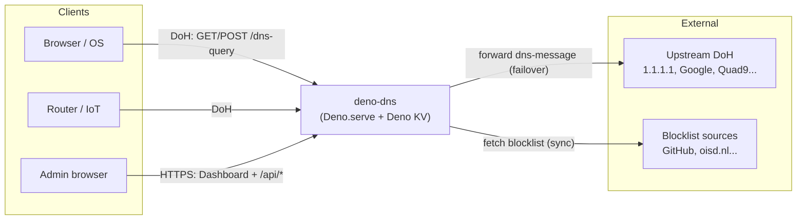
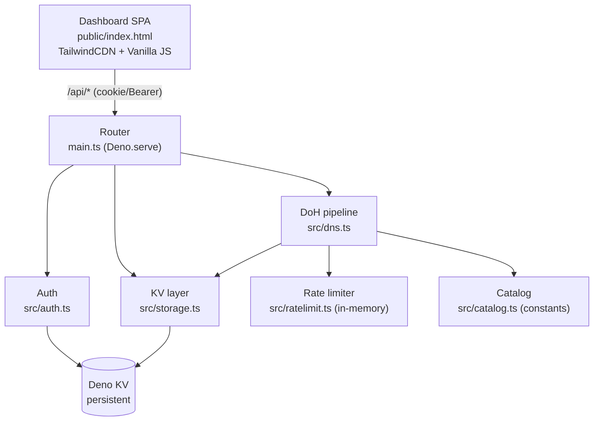
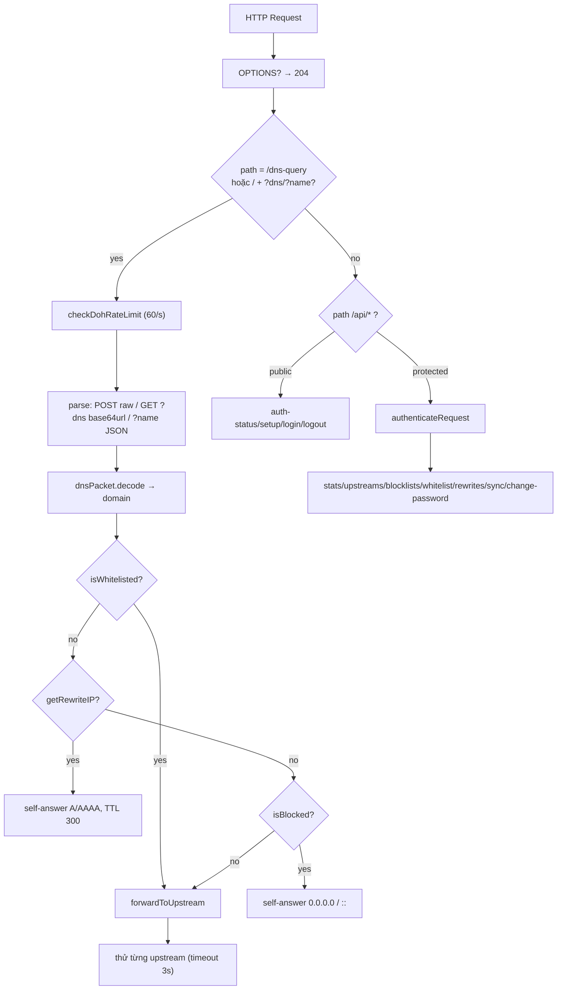
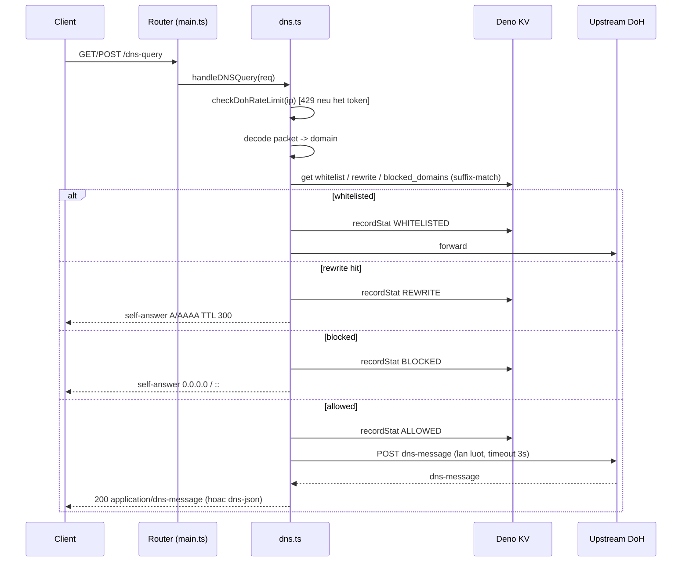
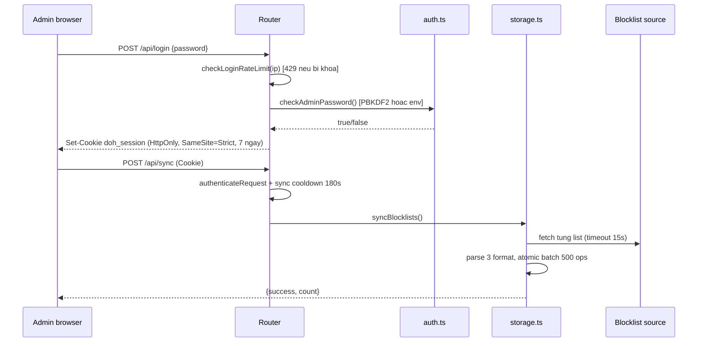

# 🏗️ Thiết kế Kiến trúc — deno-dns

> Tài liệu kiến trúc hệ thống DNS-over-HTTPS serverless có lọc nội dung + dashboard quản trị.
> Đối tượng: reviewer kiến trúc, người vận hành, contributor mới.
> Tài liệu liên quan: [README](../README.md) · [Thiết kế phần mềm](SOFTWARE_DESIGN.md)

---

## 1. Tổng quan hệ thống

**deno-dns** là một DoH server (RFC 8484) single-process chạy trên Deno, đóng vai trò
**DNS forwarder có lọc**: nhận truy vấn DNS qua HTTPS, áp policy (whitelist → rewrite →
blocklist), rồi forward tới upstream DoH công cộng. Kèm dashboard quản trị (`public/index.html`)
và toàn bộ state lưu trong **Deno KV**.

Mục tiêu phi chức năng chính: độ trễ thấp, triển khai 1 lệnh, không cần DB ngoài,
chịu tải DDoS cơ bản ở tầng ứng dụng.

## 2. Sơ đồ Context (C4 Level 1)

## 3. Sơ đồ Container (C4 Level 2)

Toàn bộ backend là **một tiến trình Deno duy nhất** (`main.ts` → `Deno.serve`).
Không có worker, queue, hay DB rời.

| Container | Công nghệ | Trách nhiệm |
|-----------|-----------|-------------|
| Router | `Deno.serve`, `Request/Response` Web API | CORS preflight, trích client IP, định tuyến DoH vs API vs static |
| DoH pipeline | `dns-packet@5.6.1`, `node:buffer` | decode/encode gói DNS, policy 4 tầng, failover upstream |
| Auth | WebCrypto PBKDF2 | hash/verify password, session UUID TTL 7 ngày |
| KV layer | `Deno.openKv()` | catalog, whitelist, rewrite, blocked_domains, stats `KvU64`, logs |
| Rate limiter | `Map` in-memory + `setInterval` sweep | TokenBucket DoH/API, login lockout, sync cooldown |
| Dashboard | Single HTML file, `fetch` | CRUD catalog/rules, stats poll 4s, sync trigger |

## 4. Sơ đồ Component & Luồng dữ liệu

## 5. Sequence: truy van DoH

## 6. Sequence: login va sync blocklist

## 7. Mo hinh du lieu (Deno KV schema)

| Key pattern | Value | Ghi chu |
|---|---|---|
| `["config","upstreams_catalog"]` | `UpstreamItem[]` | `{id,name,url,description,tag,tagLabel,enabled,isCustom?}`. Seed tu `DEFAULT_UPSTREAMS` (16 muc). Migration tu key cu `["config","upstreams"]: string[]` giu tuong thich nguoc. |
| `["config","blocklists_catalog"]` | `BlocklistItem[]` | `{id,name,url,description,category,categoryLabel,enabled,count?,isCustom?}`. Seed 6 muc, 3 muc bat mac dinh. |
| `["config","total_blocked_count"]` | `number` | Tong domain dem duoc lan sync cuoi. |
| `["blocked_domains", domain]` | `true` | Flat set. Tra cuu suffix-match: `a.b.c` check `a.b.c`, `b.c`. Khong luu theo tung list. |
| `["whitelist", domain]` | `true` | Suffix-match giong blocklist (cho phep subdomain ke thua). |
| `["rewrites", domain]` | `string (IP)` | Exact-match + wildcard `*.domain`. IPv4 tra cho query A, IPv6 cho AAAA. |
| `["stats","total"\|"blocked"\|"allowed"]` | `Deno.KvU64` | Tang bang `atomic().sum(1n)`. WHITELISTED/REWRITE/ALLOWED dem vao `allowed`. |
| `["logs", timestamp, uuid]` | `{id,time,domain,status,clientIp}` | `time` format `vi-VN`. Lay 50 moi nhat (`list reverse limit 50`). Khong TTL — can cron don. |
| `["auth","password_hash"]` | `string salt:hash` | PBKDF2-SHA256 100k, salt 16B hex. Bi bypass khi co env `ADMIN_PASSWORD`. |
| `["sessions", uuid]` | `{expiresAt}` + `expireIn: 7 ngay` | KV tu xoa khi het han. Verify them lan nua o code. |

## 8. Quyet dinh kien truc (ADR)

**ADR-1: Deno KV thay SQLite/Postgres.** Ly do: Deploy zero-config, persistent san tren Deno Deploy, API atomic sum phu hop counter. Danh doi: khong query phuc tap, list full-table kem khi log lon.

**ADR-2: Rate-limit in-memory thay vi KV.** Ly do: check TokenBucket moi query DNS can do tre ~0ms; ghi KV moi request se chiu phi latency + cost. Danh doi: per-instance (multi-region khong share), mat khi restart. Chap nhan vi muc tieu la giam tai co hoi, khong phai gioi han thanh toan chuan xac.

**ADR-3: Failover tuan tu thay vi race song song.** Ly do: don gian, tranh tao song amplify toi upstream. Timeout 3s/upstream. Cai tien tuong lai: race 2 nhanh nhat + health score.

**ADR-4: Single HTML dashboard thay SPA framework.** Ly do: 1 file, khong build step, deploy copy-paste. Danh doi: kho bao tri khi >1000 dong, khong component hoa.

**ADR-5: Suffix-match o application thay vi regex engine.** Ly do: tra cuu KV O(labels) chinh xac, tranh ReDoS, de hieu.

## 9. Mo hinh de doa (Threat model)

| Moi de doa | Bien phap hien co | Con thieu |
|---|---|---|
| DDoS/Query flood | TokenBucket 60 req/s burst 120 + 429 + Retry-After + metrics | Chua co block IP vinh vien, chua co PoW/captcha |
| Brute-force admin | 5 sai khoa 15p + PBKDF2 100k + session 7 ngay | Chua co 2FA/TOTP |
| CSRF | Cookie SameSite=Strict + ho tro Bearer cho API tool | Cookie khong co __Host- prefix |
| XSS via domain log | Dashboard render bang innerHTML — domain tu nguon ngoai co the tiem HTML | Can escape HTML khi render logs |
| Upstream spoofing | Chi forward toi URL https trong catalog, timeout 3s | Chua pin cert, chua DNSSEC validate local |
| Abuse sync (SSRF) | Sync chi tu admin authenticated, cooldown 180s | URL custom chua validate scheme/host — admin co the fetch URL noi bo |
| Packet lon | Gioi han 4096 bytes, tra 400 | — |

## 10. Yeu cau phi chuc nang (NFR)

- **Hieu nang:** DoH p50 < 150ms khi cache upstream nong; self-answer (block/rewrite) < 20ms + 2-3 KV read. Cache-Control 300s de browser/CDN cache.
- **San sang:** single instance; fallback upstream dam bao tra loi mien la con 1 upstream song. Mat rate-limit khi restart la chap nhan duoc.
- **Mo rong:** stateless ngoai KV → scale ngang duoc, nhung bucket in-memory khong share. Neu can gioi han global: chuyen sang KV atomic hoac Redis.
- **Quan sat:** `/api/stats` tra counters + `ddosMetrics {totalDohBlocked, totalLoginBlocked, totalSyncBlocked, activeTrackedIps}`. Log console khi decode fail / fetch list loi.
- **Bao mat:** mat khau >= 6 ky tu (validation o API), hash PBKDF2, cookie HttpOnly.

## 11. Han che & Cong no ky thuat

1. Sync chi them domain, khong xoa domain cua list da tat — `blocked_domains/*` phi to dan.
2. Logs khong TTL, key tang vo han — can cron xoa `logs/*` cu hon N ngay.
3. `components/`, `islands/`, `utils.ts`, `static/` la code chet tu template Fresh — nen xoa.
4. `upstream_dns_list.json` (39KB) chua noi vao catalog — co hoi bulk import.
5. Chua co test tu dong (`deno test`), chua co CI lint/fmt/check.
6. Dashboard render logs bang noi chuoi HTML — nguy co XSS, can escape.

