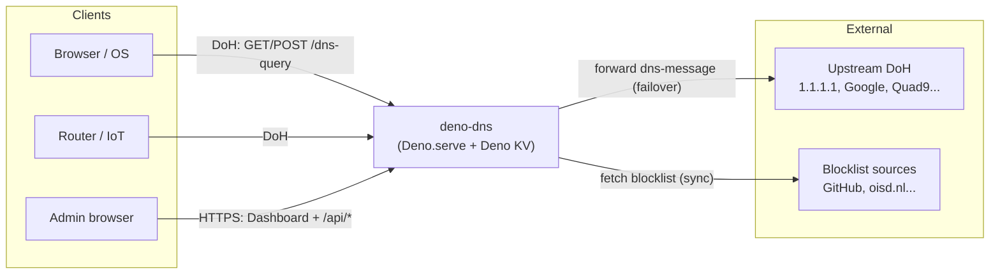
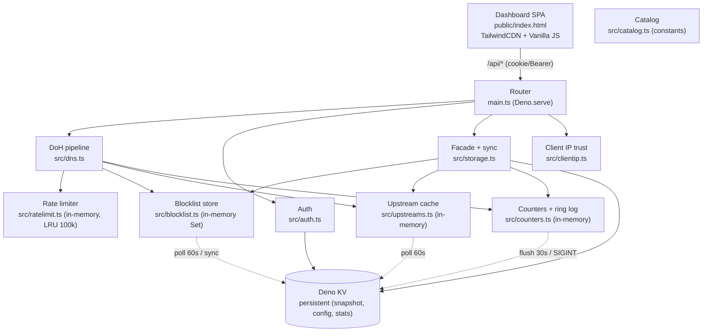
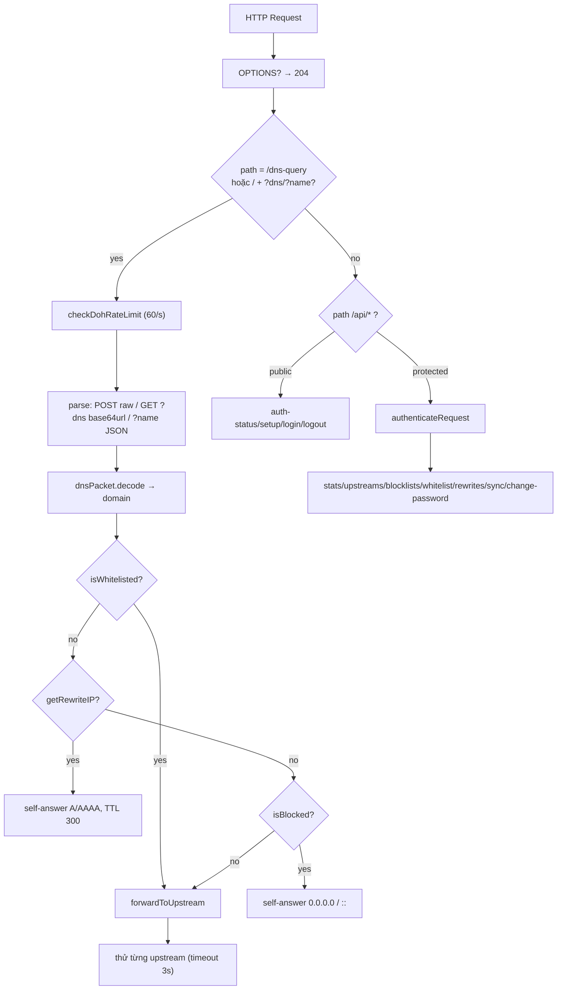
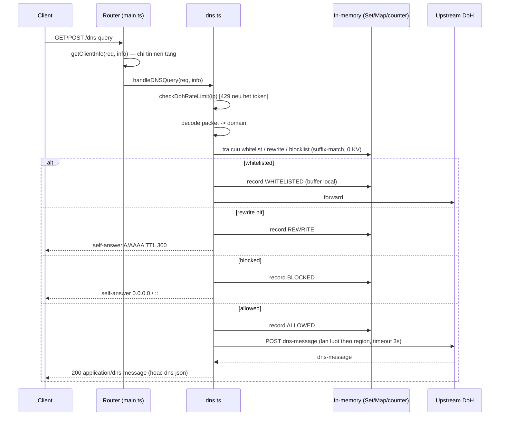
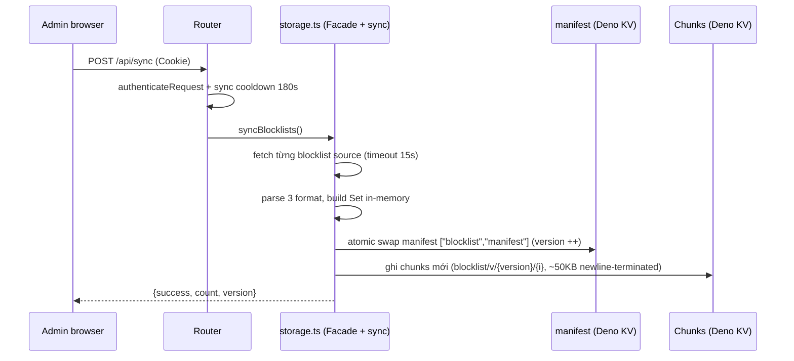

# 🏗️ Thiết kế Kiến trúc — deno-dns

> Tài liệu kiến trúc hệ thống DNS-over-HTTPS serverless có lọc nội dung +
> dashboard quản trị. Đối tượng: reviewer kiến trúc, người vận hành, contributor
> mới. Tài liệu liên quan: [README](../README.md) ·
> [Thiết kế phần mềm](SOFTWARE_DESIGN.md)

---

## 1. Tổng quan hệ thống

**deno-dns** là một DoH server (RFC 8484) single-process chạy trên Deno, đóng
vai trò **DNS forwarder có lọc**: nhận truy vấn DNS qua HTTPS, áp policy
(whitelist → rewrite → blocklist), rồi forward tới upstream DoH công cộng. Kèm
dashboard quản trị (`public/index.html`) và toàn bộ state lưu trong **Deno KV**.

Mục tiêu phi chức năng chính: độ trễ thấp, triển khai 1 lệnh, không cần DB
ngoài, chịu tải DDoS cơ bản ở tầng ứng dụng.

## 2. Sơ đồ Context (C4 Level 1)

## 3. Sơ đồ Container (C4 Level 2)

Toàn bộ backend là **một tiến trình Deno duy nhất** (`main.ts` → `Deno.serve`).
Không có worker, queue, hay DB rời.

| Container       | Công nghệ                                | Trách nhiệm                                                                                                       |
| --------------- | ---------------------------------------- | ----------------------------------------------------------------------------------------------------------------- |
| Router          | `Deno.serve`, `Request/Response` Web API | CORS preflight, định tuyến DoH vs API vs static, `GET /api/diag/headers` (verify header nền tảng)                 |
| DoH pipeline    | `dns-packet@5.6.1`, `node:buffer`        | decode/encode gói DNS, policy 4 tầng (in-memory), failover upstream theo region node                              |
| Client IP trust | `src/clientip.ts`                        | Chỉ tin header/remoteAddr của nền tảng; chống spoofing `x-forwarded-for`/`cf-connecting-ip`; cap bucket "unknown" |
| Blocklist store | `src/blocklist.ts`                       | Set blocked/whitelist + Map rewrite in-memory; poll manifest 60s, build Set từ chunks, swap atomic                |
| Upstream cache  | `src/upstreams.ts`                       | Catalog in-memory; sắp xếp upstream theo region node (`eu`/`us`/default), fallback 2 upstream                     |
| Counters        | `src/counters.ts`                        | Counter in-memory + flush atomic gom (30s hoặc delta ≥ 10k, SIGINT); ring buffer log 50 entry/instance            |
| KV facade       | `src/storage.ts`, `Deno.openKv()`        | CRUD admin (catalog/whitelist/rewrite), sync snapshot, merge stats KV + delta local                               |
| Auth            | WebCrypto PBKDF2                         | hash/verify password, session UUID TTL 7 ngày                                                                     |
| Rate limiter    | `LruMap` in-memory (cap 100k key)        | TokenBucket DoH/API, login lockout, sync cooldown — chặn memory-exhaustion bằng IP giả                            |
| Dashboard       | Single HTML file, `fetch`                | CRUD catalog/rules, stats poll 4s (gồm `localDelta`), sync trigger, escape HTML khi render                        |

## 4. Sơ đồ Component & Luồng dữ liệu

## 5. Sequence: truy van DoH

Hot path DoH chi chay **in-memory (0 op Deno KV)** — tra cuu Set/Map co san
trong isolate, counter tang vao buffer local. KV chi duoc ghi boi 3 luu nen chu
ky: poll snapshot (60s), flush counter (30s / delta / SIGINT), va sync
blocklist.

## 6. Sequence: sync blocklist → snapshot versioning

Snapshot MVCC dùng `blocklist/manifest` để theo dõi version, mỗi version chunks
~50KB newline-terminated. Sync ghi batch chặn 500 ops, sau đó atomic swap
manifest. KV ops: 0 trên hot path; chỉ ghi bo snapshot (60s), flush counter (30s
/ delta / SIGINT), và sync blocklist.

## 7. Mo hinh du lieu (Deno KV schema)

| Key pattern                               | Value                              | Ghi chu                                                                                                                                                                         |
| ----------------------------------------- | ---------------------------------- | ------------------------------------------------------------------------------------------------------------------------------------------------------------------------------- |
| `["config","upstreams_catalog"]`          | `UpstreamItem[]`                   | `{id,name,url,description,tag,tagLabel,enabled,isCustom?}`. Seed tu `DEFAULT_UPSTREAMS` (16 muc). Migration tu key cu `["config","upstreams"]: string[]` giu tuong thich nguoc. |
| `["config","blocklists_catalog"]`         | `BlocklistItem[]`                  | `{id,name,url,description,category,categoryLabel,enabled,count?,isCustom?}`. Seed 6 muc, 3 muc bat mac dinh.                                                                    |
| `["config","total_blocked_count"]`        | `number`                           | Tong domain dem duoc lan sync cuoi.                                                                                                                                             |
| `["blocklist","manifest"]`                | `number`                           | Version hien tai. Chunks moi duoc ghi voi key `blocklist/v/{version}/{i}` (newline-terminated, ~50KB moi chunk). Lay luc truy van bang atomic swap.                             |
| `["blocklist", "v", version, i]`          | `string[]`                         | Mỗi chunk la mang string domain duoc block (suffix-match). Index `i` tang tu 0.                                                                                                 |
| `["whitelist", domain]`                   | `true`                             | Suffix-match giong blocklist (cho phep subdomain ke thua).                                                                                                                      |
| `["rewrites", domain]`                    | `string (IP)`                      | Exact-match + wildcard `*.domain`. IPv4 tra cho query A, IPv6 cho AAAA.                                                                                                         |
| `["stats","total"\|"blocked"\|"allowed"]` | `Deno.KvU64`                       | Tang bang `atomic().sum` theo dong luong (batch flush 30s hoặc delta ≥ 10k thay vì 1 request/1 increment).                                                                      |
| `["auth","password_hash"]`                | `string salt:hash`                 | PBKDF2-SHA256 100k, salt 16B hex. Bi bypass khi co env `ADMIN_PASSWORD`.                                                                                                        |
| `["sessions", uuid]`                      | `{expiresAt}` + `expireIn: 7 ngay` | KV tu xoa khi het han. Verify them lan nua o code.                                                                                                                              |

## 8. Quyet dinh kien truc (ADR)

**ADR-1: Deno KV thay SQLite/Postgres.** Ly do: Deploy zero-config, persistent
san tren Deno Deploy, API atomic sum phu hop counter. Danh doi: khong query phuc
tap, list full-table kem khi log lon.

**ADR-2: Rate-limit in-memory thay vi KV.** Ly do: check TokenBucket moi query
DNS can do tre ~0ms; ghi KV moi request se chiu phi latency + cost. Danh doi:
per-instance (multi-region khong share), mat khi restart. Chap nhan vi muc tieu
la giam tai co hoi, khong phai gioi han thanh toan chuan xac.

**ADR-3: Failover tuan tu thay vi race song song.** Ly do: don gian, tranh tao
song amplify toi upstream. Timeout 3s/upstream. Cai tien tuong lai: race 2 nhanh
nhat + health score.

**ADR-4: Single HTML dashboard thay SPA framework.** Ly do: 1 file, khong build
step, deploy copy-paste. Danh doi: kho bao tri khi >1000 dong, khong component
hoa.

**ADR-5: Suffix-match o application thay vi regex engine.** Ly do: tra cuu KV
O(labels) chinh xac, tranh ReDoS, de hieu.

**ADR-6: In-memory snapshot + 0-KV hot path.** Lý do: Cùng cấp tốc độ qua
in-memory Set/Map (0 op Deno KV cho query DNS), đồng thời Deno KV vẫn dùng cho
state dài hạn (catalog, whitelist, blocked_domains manifest). Danh đối: cần đồng
bộ snapshot (60s) giữ cho KV và bộ nhớ in-memory nhất quán.

**ADR-7: Trọng tin client IP từ nền tảng.** Lý do: Bỏ qua `x-forwarded-for`,
`x-real-ip`, `cf-connecting-ip` do client gửi; dùng `x-denoforwarded-for`
(header nền tảng `PLATFORM_CLIENT_IP_HEADER`) theo sau là
`info.remoteAddr.hostname`. Từ chối private/loopback địa chỉ từ header. Danh
đối: chống spoofing IP giả.

| Moi de doa         | Bien phap hien co                                                                                 | Con thieu                                       |
| ------------------ | ------------------------------------------------------------------------------------------------- | ----------------------------------------------- |
| DDoS/Query flood   | TokenBucket 60 req/s burst 120 + 429 + Retry-After + metrics                                      | Chua co block IP vinh vien, chua co PoW/captcha |
| Brute-force admin  | 5 sai khoa 15p + PBKDF2 100k + session 7 ngay                                                     | Chua co 2FA/TOTP                                |
| CSRF               | Cookie SameSite=Strict + ho tro Bearer cho API tool                                               | Cookie khong co __Host- prefix                  |
| XSS via domain log | Da đc giải quyết — escaping HTML khi render logs                                                  | —                                               |
| Upstream spoofing  | Da đc giữè — chi forward URL https trong catalog; block private IP                                | —                                               |
| Abuse sync (SSRF)  | Da đc giữè — sync chi admin authenticated, cooldown 180s; URL validate scheme/host                | —                                               |
| Client IP spoofing | Da đc giữè — chi tin x-denoforwarded-for + remoteAddr hostname; bác bỏ private/loopback từ header | —                                               |
| Packet lon         | Gioi han 4096 bytes, tra 400                                                                      | —                                               |

## 10. Yeu cau phi chuc nang (NFR)

- **Hieu nang:** DoH p50 < 20ms boi cache bo trong-memory (0 op Deno KV cho
  self-answer block/rewrite); forward upstream co cache upstream (Cache-Control
  300s).
- **San sang:** single instance; fallback upstream dam bao tra loi mien la con 1
  upstream song. Mat rate-limit khi restart la chap nhan duoc.
- **Mo rong:** stateless ngoai KV → scale ngang duoc toan bo hot path bang
  in-memory (LRU 100k key). Neu can gioi han toan cuc: chuyen sang KV atomic
  hoac Redis.
- **Quan sat:** `/api/stats` tra counters +
  `ddosMetrics {totalDohBlocked, totalLoginBlocked, totalSyncBlocked, activeTrackedIps}`.
  Log khi decode fail / fetch list loi.
- **Bao mat:** mat khau >= 6 ky tu (validation o API), hash PBKDF2, cookie
  HttpOnly.

## 11. Han che & Cong no ky thuat

1. Da đc giải quyết — sync hiện dùng snapshot (chunks + manifest), không thêm
   domain vào `blocked_domains/*` trực tiếp.
2. Da đc giải quyết — logs lưu trong bộ nhớ ring buffer (in-memory), không có
   TTL, dọn dẹp qua cron.
3. Da đc giải quyết — `components/`, `islands/`, `utils.ts`, `static/` là code
   chết từ template Fresh — đã xóa.
4. Còn lại — `upstream_dns_list.json` (39KB) chưa nội dung vào catalog — có thể
   bulk import thủ công.
5. Da đc giải quyết — `deno test` chạy xanh (toàn bộ test suite green).
6. Da đc giải quyết — Dashboard render logs bằng escape HTML — không còn nguy cơ
   XSS.
